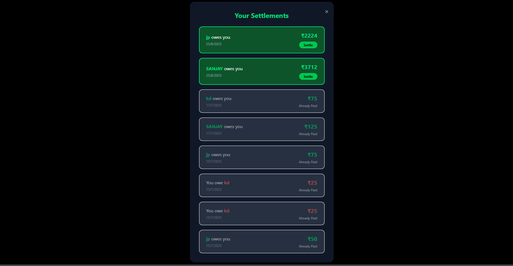

# Splitwise Clone

This project is a full-stack clone of Splitwise, allowing users to manage group expenses, track balances, and settle up efficiently. It features a modern frontend and a robust backend, providing a seamless experience for splitting expenses among friends and groups.

## Features

- **Group Expense Management:** Create groups, add members, and track shared expenses.
- **Optimal Settlement Algorithm:** Uses a heap-based algorithm to minimize the number of transactions required to settle debts among group members.
- **Degree of Connection:** Find the degree of connection between users (friends of friends) using BFS.
- **User Authentication:** Secure login and signup functionality.
- **Responsive UI:** Modern, user-friendly interface.

## Algorithms Used

### 1. Split Algorithm (Heap-based Settlement)
To optimize the settlement process, the backend uses a heap data structure. This ensures that the minimum number of transactions are required to settle all debts within a group, making the process efficient and fair.

### 2. Degree of Connection (BFS)
To showcase how users are connected (direct friends, friends of friends, etc.), the backend implements a BFS algorithm. This allows users to see how closely they are connected to others in the network.

## Tech Stack

- **Frontend:** React, Tailwind CSS, Vite
- **Backend:** Node.js, Express.js
- **Database:** (Add your DB here, e.g., MongoDB, etc.)

## Class Diagram


## IMAGES :




## Getting Started

### Prerequisites

- Node.js and npm installed

### Backend Setup

```bash
cd backend
npm install
# Configure your database in backend/config/db.js
npm start
```

### Frontend Setup

```bash
cd frontend
npm install
npm run dev
```

### Usage

1. Start the backend server.
2. Start the frontend development server.
3. Access the app in your browser at `http://localhost:5174` 

## Folder Structure

- `backend/` - Express.js backend with all API routes, controllers, models, and utility algorithms.
- `frontend/` - React frontend with all UI components and pages.

## Contributing

Pull requests are welcome. For major changes, please open an issue first to discuss what you would like to change.
